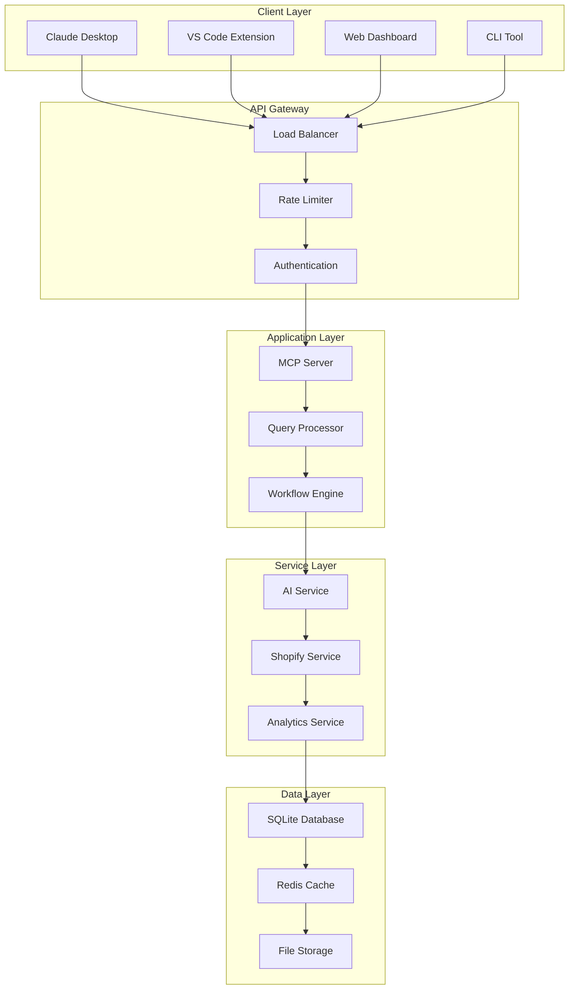

# 🛍️ Shopify AI Agent

> **Enterprise-grade AI-powered agent for Shopify store management using Model
> Context Protocol (MCP)**

[](https://opensource.org/licenses/MIT)
[](https://nodejs.org/)
[](https://www.typescriptlang.org/)
[]()
[]()

## 📋 Table of Contents

- [Overview](#-overview)
- [Features](#-features)
- [Architecture](#-architecture)
- [Quick Start](#-quick-start)
- [Development Roadmap](#-development-roadmap)
- [Installation](#-installation)
- [Configuration](#-configuration)
- [API Documentation](#-api-documentation)
- [MCP Integration](#-mcp-integration)
- [Examples](#-examples)
- [Contributing](#-contributing)
- [License](#-license)

## 🎯 Overview

The Shopify AI Agent is an open-source, enterprise-grade solution that bridges
the gap between AI applications and Shopify store management. Built using the
Model Context Protocol (MCP), it enables natural language interactions with your
Shopify store through AI assistants like Claude, ChatGPT, and more.

### 🔥 What Makes It Special

- **🧠 AI-First Design**: Natural language queries for complex e-commerce
  operations
- **🔌 MCP Protocol**: Seamless integration with AI applications via
  standardized protocol
- **🏗️ Enterprise Architecture**: Clean architecture with SOLID principles
- **⚡ High Performance**: Multi-tier caching, optimized database operations
- **🔐 Security Focused**: JWT authentication, rate limiting, security headers
- **🎛️ Pluggable AI**: Support for multiple AI providers (Gemini, OpenAI,
  Claude)
- **📊 Rich Analytics**: Real-time insights and business intelligence
- **🔄 Workflow Automation**: Intelligent business process automation

## ✨ Features

### 🛍️ **E-commerce Management**

- **Product Operations**: Create, update, delete, and manage inventory
- **Order Processing**: Track orders, update status, process refunds
- **Customer Management**: View customer data, order history, segmentation
- **Analytics & Reporting**: Sales data, performance metrics, trend analysis

### 🤖 **AI-Powered Capabilities**

- **Natural Language Queries**: "What are my top selling products this week?"
- **Intelligent Automation**: Automated workflows based on business rules
- **Predictive Analytics**: AI-driven insights and recommendations
- **Context-Aware Responses**: Maintains conversation context across requests

### 🔧 **Technical Features**

- **Multi-Store Support**: Manage multiple Shopify stores from one interface
- **Real-Time Updates**: WebSocket notifications for live data
- **Robust Caching**: Redis + Memory caching for optimal performance
- **Rate Limiting**: Intelligent API rate limiting with backoff strategies
- **Comprehensive Logging**: Structured logging with multiple outputs

## 🏗️ Architecture



### 🔧 **Design Patterns**

- **Clean Architecture**: Dependency inversion, separation of concerns
- **Repository Pattern**: Data access abstraction
- **Factory Pattern**: AI provider instantiation
- **Strategy Pattern**: Query processing strategies
- **Observer Pattern**: Event-driven workflows
- **CQRS**: Command Query Responsibility Segregation

## 🚀 Quick Start

### Prerequisites

- **Node.js** 18.0+
- **npm** or **yarn**
- **Shopify Partner Account** with API access
- **AI Provider API Key** (Gemini, OpenAI, or Claude)

### 1-Minute Setup

```bash
# Clone the repository
git clone https://github.com/yourusername/shopify-ai-agent.git
cd shopify-ai-agent

# Install dependencies
npm install

# Copy environment configuration
cp .env.development .env

# Configure your API keys
nano .env  # Add your Shopify and AI provider keys

# Run database migrations
npm run db:migrate

# Start development server
npm run dev
```

### 🎉 Test Your Installation

```bash
# Health check
curl http://localhost:3000/health

# Test MCP connection
npm run mcp:test

# Run example query
npm run example:query "What are my top products?"
```

## 📈 Development Roadmap

Our development follows a **block-based approach** where each block is
independently testable and deployable:

### 🏗️ **Phase 1: Foundation (Blocks 1-3)**

- [x] **Block 1.1**: Project setup & configuration
- [ ] **Block 1.2**: Environment & config management
- [ ] **Block 1.3**: Logging & error handling

### 💾 **Phase 2: Data Layer (Blocks 4-6)**

- [ ] **Block 2.1**: Database foundation
- [ ] **Block 2.2**: Repository pattern
- [ ] **Block 2.3**: Caching layer

### 🧠 **Phase 3: Core Logic (Blocks 7-8)**

- [ ] **Block 3.1**: Domain entities
- [ ] **Block 3.2**: Use cases & business logic

### 🔌 **Phase 4: Integrations (Blocks 9-10)**

- [ ] **Block 4.1**: AI provider infrastructure
- [ ] **Block 4.2**: Shopify API integration

### ⚙️ **Phase 5: Services (Blocks 11-12)**

- [ ] **Block 5.1**: Query processing engine
- [ ] **Block 5.2**: Workflow engine

### 🌐 **Phase 6: API Layer (Blocks 13-15)**

- [ ] **Block 6.1**: Express server setup
- [ ] **Block 6.2**: Authentication & authorization
- [ ] **Block 6.3**: REST API endpoints

### 🔗 **Phase 7: MCP Server (Blocks 16-18)**

- [ ] **Block 7.1**: MCP protocol handler
- [ ] **Block 7.2**: MCP tools implementation
- [ ] **Block 7.3**: MCP resources & prompts

### 📊 **Phase 8: Advanced Features (Blocks 19-21)**

- [ ] **Block 8.1**: Analytics service
- [ ] **Block 8.2**: Notification system
- [ ] **Block 8.3**: Queue & background jobs

### 🧪 **Phase 9: Testing (Blocks 22-24)**

- [ ] **Block 9.1**: Unit testing framework
- [ ] **Block 9.2**: Integration testing
- [ ] **Block 9.3**: Performance testing

### 🚀 **Phase 10: DevOps (Blocks 25-27)**

- [ ] **Block 10.1**: Docker setup
- [ ] **Block 10.2**: CI/CD pipeline
- [ ] **Block 10.3**: Monitoring & observability

### 📚 **Phase 11: Documentation (Blocks 28-30)**

- [ ] **Block 11.1**: API documentation
- [ ] **Block 11.2**: MCP client examples
- [ ] **Block 11.3**: Production deployment guide

> **Current Status**: Block 1.1 Complete ✅ | Next: Block 1.2

## 📦 Installation

### Development Installation

```bash
# Clone the repository
git clone https://github.com/yourusername/shopify-ai-agent.git
cd shopify-ai-agent

# Install dependencies
npm install

# Install development tools
npm run install:dev

# Setup pre-commit hooks
npm run setup:hooks
```

### Production Installation

```bash
# Using Docker (Recommended)
docker-compose up -d

# Or manual installation
npm ci --only=production
npm run build
npm run start:prod
```

### Environment Setup

```bash
# Development
cp .env.development .env

# Production
cp .env.production .env

# Docker
cp .env.docker .env
```

## ⚙️ Configuration

### Environment Variables

| Variable                 | Description                        | Default         | Required |
| ------------------------ | ---------------------------------- | --------------- | -------- |
| `SHOPIFY_APP_API_KEY`    | Shopify API Key                    | -               | ✅       |
| `SHOPIFY_APP_API_SECRET` | Shopify API Secret                 | -               | ✅       |
| `AI_PROVIDER`            | AI Provider (gemini/openai/claude) | `gemini`        | ✅       |
| `GEMINI_API_KEY`         | Google Gemini API Key              | -               | ✅       |
| `DATABASE_PATH`          | SQLite database path               | `./data/app.db` | ❌       |
| `REDIS_HOST`             | Redis host                         | `localhost`     | ❌       |
| `JWT_SECRET`             | JWT signing secret                 | -               | ✅       |

### Shopify Setup

1. **Create Shopify Partner Account**
   - Visit [partners.shopify.com](https://partners.shopify.com)
   - Create a new app
   - Note your API key and secret

2. **Configure App Permissions**

   ```
   Required Scopes:
   - read_products, write_products
   - read_orders, write_orders
   - read_customers, write_customers
   - read_analytics
   ```

3. **Setup Webhooks** (Optional)
   ```
   Webhook URL: https://your-domain.com/api/webhooks/shopify
   Events: orders/create, orders/updated, products/update
   ```

### AI Provider Setup

#### Google Gemini

```bash
# Get API key from Google AI Studio
GEMINI_API_KEY=your_api_key_here
GEMINI_MODEL=gemini-1.5-pro
```

#### OpenAI (Coming Soon)

```bash
OPENAI_API_KEY=your_api_key_here
OPENAI_MODEL=gpt-4
```

#### Anthropic Claude (Coming Soon)

```bash
CLAUDE_API_KEY=your_api_key_here
CLAUDE_MODEL=claude-3-sonnet-20240229
```

## 📖 API Documentation

### REST API Endpoints

#### Authentication

```http
POST /api/auth/login
POST /api/auth/refresh
POST /api/auth/logout
```

#### Store Management

```http
GET    /api/stores
POST   /api/stores
GET    /api/stores/:id
PUT    /api/stores/:id
DELETE /api/stores/:id
```

#### Query Processing

```http
POST   /api/query/process
GET    /api/query/history
GET    /api/query/cache/:hash
```

#### Analytics

```http
GET    /api/analytics/sales
GET    /api/analytics/products
GET    /api/analytics/customers
GET    /api/analytics/dashboard
```

### API Examples

#### Process Natural Language Query

```bash
curl -X POST http://localhost:3000/api/query/process \
  -H "Content-Type: application/json" \
  -H "Authorization: Bearer your_jwt_token" \
  -d '{
    "query": "What are my top 5 selling products this week?",
    "storeId": "your_store_id"
  }'
```

#### Get Sales Analytics

```bash
curl -X GET "http://localhost:3000/api/analytics/sales?period=7d" \
  -H "Authorization: Bearer your_jwt_token"
```

## 🔗 MCP Integration

### Setup with Claude Desktop

1. **Install Claude Desktop**
   - Download from [claude.ai](https://claude.ai/download)

2. **Configure MCP Server**

   ```json
   // ~/.claude/mcp_servers.json
   {
     "servers": {
       "shopify-ai-agent": {
         "command": "node",
         "args": ["path/to/shopify-ai-agent/dist/mcp/server.js"],
         "env": {
           "SHOPIFY_STORE_URL": "your-store.myshopify.com",
           "SHOPIFY_ACCESS_TOKEN": "your_access_token"
         }
       }
     }
   }
   ```

3. **Start Using**
   ```
   Claude: What are my top selling products this month?
   Agent: Here are your top 5 selling products for October 2024...
   ```

### VS Code Extension

```bash
# Install the extension
code --install-extension shopify-ai-agent

# Configure in settings.json
{
  "shopifyAiAgent.serverPath": "./dist/mcp/server.js",
  "shopifyAiAgent.autoStart": true
}
```

### Custom MCP Client

```typescript
import { MCPClient } from '@modelcontextprotocol/client';

const client = new MCPClient({
  serverPath: './dist/mcp/server.js',
  capabilities: ['tools', 'resources', 'prompts'],
});

// Use available tools
const result = await client.callTool('get_products', {
  limit: 10,
  status: 'active',
});
```

## 💡 Examples

### Common Queries

```typescript
// Sales Analysis
'What was my revenue for the last 30 days?';
'Show me the best performing products by category';
'Which customers have the highest lifetime value?';

// Inventory Management
'Which products are running low on stock?';
'Update the price of all winter jackets to $89.99';
"Show me products that haven't sold in 60 days";

// Order Management
'List all unfulfilled orders from this week';
'Mark order #1234 as shipped with tracking ABC123';
'Show me orders over $500 from VIP customers';

// Customer Insights
'Who are my top 10 customers by purchase volume?';
'Show me customers who abandoned carts worth over $100';
'Find customers from New York who bought electronics';

// Business Intelligence
'Generate a weekly sales report for my team meeting';
'Identify trends in my seasonal product sales';
'Calculate ROI for each of my marketing channels';
```

### Workflow Automation

```typescript
// Low Stock Alert Workflow
{
  "name": "Low Stock Alert",
  "trigger": {
    "type": "schedule",
    "schedule": "0 9 * * *" // Daily at 9 AM
  },
  "conditions": [
    {
      "field": "inventory_quantity",
      "operator": "lt",
      "value": 10
    }
  ],
  "actions": [
    {
      "type": "email",
      "template": "low_stock_alert",
      "recipients": ["inventory@company.com"]
    },
    {
      "type": "slack",
      "channel": "#inventory-alerts",
      "message": "⚠️ Low stock alert: {{product_title}} has {{inventory_quantity}} units left"
    }
  ]
}
```

## 🧪 Testing

### Running Tests

```bash
# All tests
npm test

# Unit tests only
npm run test:unit

# Integration tests only
npm run test:integration

# E2E tests
npm run test:e2e

# With coverage
npm run test:coverage

# Watch mode
npm run test:watch
```

### Test Structure

```
tests/
├── unit/           # Unit tests (business logic)
├── integration/    # Integration tests (APIs, DB)
├── e2e/           # End-to-end tests (full workflows)
├── fixtures/      # Test data
├── mocks/         # Mock implementations
└── setup/         # Test configuration
```

### Performance Testing

```bash
# Load testing
npm run test:load

# Memory profiling
npm run test:memory

# Database performance
npm run test:db-performance
```

## 🚀 Deployment

### Docker Deployment

```bash
# Build image
docker build -t shopify-ai-agent .

# Run with docker-compose
docker-compose up -d

# Scale services
docker-compose up -d --scale app=3
```

### Kubernetes Deployment

```bash
# Apply manifests
kubectl apply -f k8s/

# Check status
kubectl get pods -n shopify-ai-agent

# View logs
kubectl logs -f deployment/shopify-ai-agent
```

### Environment-Specific Deployments

```bash
# Development
npm run deploy:dev

# Staging
npm run deploy:staging

# Production
npm run deploy:prod
```

## 📊 Monitoring

### Health Endpoints

```bash
# Basic health check
GET /health

# Detailed health with dependencies
GET /health/detailed

# Readiness probe (K8s)
GET /ready

# Liveness probe (K8s)
GET /live
```

### Metrics

```bash
# Prometheus metrics
GET /metrics

# Custom metrics endpoint
GET /api/metrics/custom
```

### Logging

```bash
# View logs
npm run logs

# Follow logs
npm run logs:follow

# Error logs only
npm run logs:error
```

## 🤝 Contributing

We welcome contributions! Please see our [Contributing Guide](CONTRIBUTING.md)
for details.

### Development Workflow

1. **Fork the repository**
2. **Create a feature branch**
   ```bash
   git checkout -b feature/block-X.Y-description
   ```
3. **Implement the block**
   - Write code
   - Add tests
   - Update documentation
4. **Test thoroughly**
   ```bash
   npm run test:full
   npm run lint
   npm run type-check
   ```
5. **Submit a pull request**

### Code Standards

- **TypeScript**: Strict mode enabled
- **ESLint**: Airbnb configuration
- **Prettier**: Automatic formatting
- **Coverage**: Minimum 90% test coverage
- **Documentation**: JSDoc for all public methods

### Commit Convention

```
type(scope): description

feat(auth): add JWT authentication
fix(cache): resolve Redis connection issue
docs(readme): update installation guide
test(api): add integration tests for orders
```

## 📄 License

This project is licensed under the MIT License - see the [LICENSE](LICENSE) file
for details.

## 🙏 Acknowledgments

- **Shopify** for their excellent API documentation
- **Anthropic** for the Model Context Protocol specification
- **Google** for Gemini AI capabilities
- **Open Source Community** for the amazing tools and libraries

## 📞 Support

- **📧 Email**: support@shopify-ai-agent.com
- **💬 Discord**: [Join our community](https://discord.gg/shopify-ai-agent)
- **🐛 Issues**:
  [GitHub Issues](https://github.com/yourusername/shopify-ai-agent/issues)
- **📚 Docs**: [Full Documentation](https://docs.shopify-ai-agent.com)

## 🔗 Links

- **🌐 Website**: [shopify-ai-agent.com](https://shopify-ai-agent.com)
- **📖 Documentation**:
  [docs.shopify-ai-agent.com](https://docs.shopify-ai-agent.com)
- **🔧 API Reference**:
  [api.shopify-ai-agent.com](https://api.shopify-ai-agent.com)
- **📊 Status Page**:
  [status.shopify-ai-agent.com](https://status.shopify-ai-agent.com)

---

<div align="center">

**Built with ❤️ by the Shopify AI Agent Team**

[⭐ Star us on GitHub](https://github.com/yourusername/shopify-ai-agent) |
[🚀 Try the Demo](https://demo.shopify-ai-agent.com) |
[📖 Read the Docs](https://docs.shopify-ai-agent.com)

</div>
